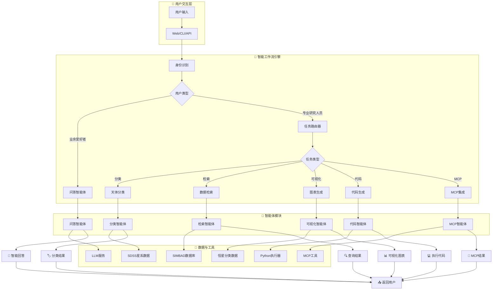
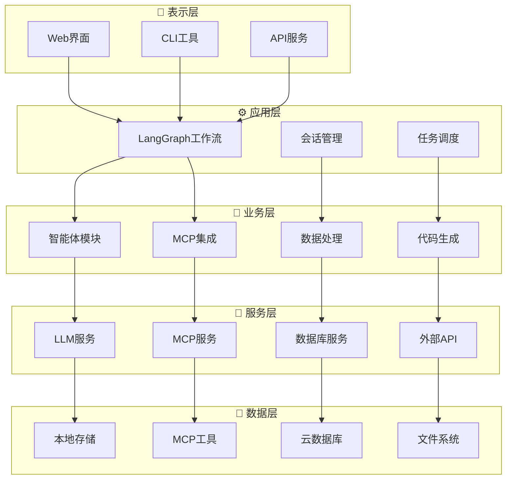

# Astro-Insight: 先进天文研究智能体系统

*基于LangGraph的综合天文研究助手，具备智能问答、天体分类、数据检索、文献综述和代码生成功能。*

[快速开始](#快速开始) | [API服务](./api_service/) | [系统架构](#系统架构) | [演示](./interactive_demo.py) | [流程图](./展示流程图.md)

## 项目介绍

Astro-Insight是一个基于LangGraph和先进AI技术的前沿天文研究助手。该系统为业余天文爱好者和专业研究人员提供了一套全面的工具，包括智能问答、实时天体分类、复杂数据分析、自动化文献综述和智能代码生成。

**核心创新：**
- **多智能体LangGraph架构**：编排复杂的天文研究工作流
- **实时SIMBAD集成**：直接访问专业天文数据库
- **智能代码生成**：自然语言转可执行Python代码并可视化
- **MCP协议支持**：集成机器学习模型和检索工具
- **高级数据分析**：集成Supabase处理大规模天文数据集
- **学术文献挖掘**：自动化研究论文发现和综合

## 核心功能

### 多模态研究能力

| 功能 | 描述 | 目标用户 |
|------|------|----------|
| **智能问答** | 具有上下文感知响应的高级天文知识库 | 业余爱好者和专业人员 |
| **天体分类** | 实时SIMBAD数据库集成进行天体识别 | 专业人员 |
| **数据分析** | 天文数据集的自动查询生成和可视化 | 专业人员 |
| **文献综述** | AI驱动的学术论文发现和综合 | 专业人员 |
| **代码生成** | 自然语言转Python代码，具有安全执行环境 | 专业人员 |
| **多轮对话** | 上下文感知的对话管理 | 所有用户 |
| **MCP集成** | 机器学习模型和检索工具集成 | 专业人员 |

### 集成数据集

- **SDSS星系分类DR18**：约100,000条记录，43个特征
- **恒星类型预测数据集**：240条记录，涵盖6种恒星分类
- **实时SIMBAD访问**：实时天文天体数据库
- **Supabase云存储**：可扩展的数据仓库集成

### 技术亮点

- **LangGraph工作流引擎**：先进的多智能体编排
- **安全代码执行**：沙盒Python环境，具有错误恢复功能
- **多LLM支持**：Ollama、OpenAI、DeepSeek、Claude、Gemini集成
- **专业API**：具有全面文档的RESTful服务
- **响应式架构**：从桌面到云部署的可扩展性

## 快速开始

### 5分钟设置

**步骤1：克隆仓库**
```bash
git clone https://github.com/xinzhuwang-wxz/Astro-Insight.git
cd Astro-Insight
```

**步骤2：安装依赖**
```bash
pip install -r requirements.txt
```

**步骤3：配置环境**
```bash
# 复制环境模板
cp env.template .env

# 编辑.env文件，添加您的API密钥
# TAVILY_API_KEY=tvly-dev-your_actual_api_key_here
```

**步骤4：启动本地LLM**
```bash
# 安装并启动Ollama
ollama serve
ollama pull qwen2.5:7b
```

**步骤5：运行系统**
```bash
# 交互模式
python main.py

# API服务
python api_service/start_api.py

# Web界面
python server.py
```

### API密钥配置

| 服务 | 必需 | 用途 | 获取API密钥 |
|------|------|------|-------------|
| **Tavily** | ✅ 是 | 网络搜索和文献 | [tavily.com](https://tavily.com) |
| **OpenAI** | ⚪ 可选 | 云端LLM | [platform.openai.com](https://platform.openai.com) |
| **DeepSeek** | ⚪ 可选 | 云端LLM | [platform.deepseek.com](https://platform.deepseek.com) |
| **Supabase** | ⚪ 可选 | 云数据库 | [supabase.com](https://supabase.com) |

## 系统架构

### 核心架构图



### 技术架构分层


### 技术栈

| 层级 | 技术 |
|------|------|
| **前端** | HTML5, CSS3, JavaScript, React (示例) |
| **后端** | Python 3.8+, FastAPI, LangGraph |
| **AI/ML** | LangChain, Ollama, OpenAI, DeepSeek, MCP |
| **数据库** | SQLite, Supabase PostgreSQL |
| **API** | SIMBAD, Tavily, REST/WebSocket, MCP协议 |
| **工具集成** | MCP ML, MCP Retrieval, Python执行器 |
| **部署** | Docker, 云就绪 |

## API文档

### RESTful API端点

**基础URL**: `http://localhost:8000`

| 端点 | 方法 | 描述 | 认证 |
|------|------|------|------|
| `/query` | POST | 主要天文查询 | 无 |
| `/status` | GET | 系统健康检查 | 无 |
| `/docs` | GET | 交互式API文档 | 无 |

### 查询API

**请求格式：**
```json
{
  "query": "分类天体M87",
  "user_type": "professional"
}
```

**响应格式：**
```json
{
  "success": true,
  "data": {
    "answer": "M87被分类为椭圆星系...",
    "task_type": "classification",
    "execution_time": 2.34,
    "generated_code": null,
    "visualization_path": null
  },
  "timestamp": "2024-01-01T12:00:00Z"
}
```

### 集成示例

**JavaScript/React：**
```javascript
const response = await fetch('/query', {
  method: 'POST',
  headers: { 'Content-Type': 'application/json' },
  body: JSON.stringify({
    query: '分析SDSS星系数据的红移分布',
    user_type: 'professional'
  })
});
```

**Python：**
```python
import requests

response = requests.post('http://localhost:8000/query', json={
    'query': '生成恒星分类模型',
    'user_type': 'professional'
})
```

## 使用示例

### 业余天文

```bash
# 基础天文问题
python main.py -q "什么是黑洞？"

# 天体信息
python main.py -q "告诉我关于仙女座星系的信息"
```

### 专业研究

```bash
# 天体分类
python main.py -q "分类天体M87"

# 数据分析
python main.py -q "分析SDSS星系红移分布"

# 文献综述
python main.py -q "综述系外行星探测方法的最新论文"
```

### 代码生成

```python
from src.coder.workflow import CodeGenerationWorkflow

workflow = CodeGenerationWorkflow()

# 生成分析代码
result = workflow.run(
    "使用恒星类型数据集创建恒星分类模型"
)

# 可视化天文数据
result = workflow.run(
    "绘制不同恒星类型的温度与光度关系图"
)
```

### MCP集成

```python
from src.mcp_ml_client import MCPMLClient
from src.mcp_retrieval.client import MCPRetrievalClient

# 机器学习模型训练
ml_client = MCPMLClient()
result = ml_client.train_model(
    "使用SDSS数据训练星系分类模型"
)

# 数据检索
retrieval_client = MCPRetrievalClient()
data = retrieval_client.search_astronomical_data(
    "查找M87星系的相关数据"
)
```

## 开发指南

### 项目结构

```
Astro-Insight-official/
├── 核心系统
│   ├── main.py                    # CLI界面
│   ├── server.py                  # Web服务器
│   ├── complete_astro_system.py   # 主系统逻辑
│   └── architectural_main.py     # 架构化主程序
│
├── 源代码 (src/)
│   ├── agents/                    # LangGraph智能体
│   ├── coder/                     # 代码生成系统
│   ├── explainer/                 # 可视化解释器
│   ├── planner/                   # 任务规划器
│   ├── mcp_ml/                    # MCP机器学习模块
│   ├── mcp_retrieval/             # MCP检索模块
│   ├── tools/                     # 外部API客户端
│   ├── llms/                      # LLM提供商
│   ├── database/                  # 数据管理
│   ├── graph/                     # LangGraph图构建
│   ├── core/                      # 核心架构
│   └── workflow.py                # 工作流引擎
│
├── API服务 (api_service/)
│   ├── main.py                    # FastAPI应用
│   ├── start_api.py               # 服务启动器
│   └── test_api.py                # API测试
│
├── 数据 (dataset/)
│   ├── dataset/                   # 数据集文件
│   │   ├── 6_class_csv.csv        # 恒星分类数据
│   │   └── sdss_100k_galaxy_form_burst.csv  # SDSS星系数据
│   └── full_description/          # 数据集描述
│
├── 静态资源 (static/)
│   ├── css/                       # 样式文件
│   └── js/                        # JavaScript文件
│
├── 模板 (templates/)
│   └── index.html                 # Web界面模板
│
└── 文档
    ├── 展示流程图.md              # 系统架构流程图
    ├── 核心流程图.md              # 核心工作流程
    └── 项目架构流程图.md          # 详细架构图
```

### 测试

```bash
# 运行所有测试
python -m pytest tests/

# 测试特定组件
python tests/test_simbad_client.py

# API集成测试
python api_service/test_api.py
```

## 贡献指南

### 如何贡献

1. Fork仓库
2. 创建功能分支：`git checkout -b feature/amazing-feature`
3. 提交更改：`git commit -m 'Add amazing feature'`
4. 推送到分支：`git push origin feature/amazing-feature`
5. 打开Pull Request

### 开发规范

- 遵循PEP 8标准
- 为新功能添加测试
- 更新相关文档
- 保持向后兼容性

## 引用

如果您在研究中使用Astro-Insight，请引用：

```bibtex
@software{astro_insight_2025,
  title={Astro-Insight: Advanced Astronomical Research Agent System},
  author={Astro-Insight Development Team},
  year={2025},
  url={https://github.com/xinzhuwang-wxz/Astro-Insight-official},
  note={LangGraph-MCP-powered astronomical research assistant}
}
```

## 许可证

本项目采用MIT许可证 - 详见[LICENSE](LICENSE)文件。

## 致谢

- **SIMBAD天文数据库** - 天体数据
- **Supabase** - 云数据库基础设施
- **LangChain/LangGraph** - AI智能体框架
- **Ollama** - 本地LLM部署
- **Tavily** - 网络搜索功能

---

**在GitHub上给我们点星** | **报告问题** | **请求功能** | **阅读文档**

*通过智能AI助手推进天文研究*