# Astro-Insight: 星之所问，信之所归

<div align="center">
  
  <p><em>🌌 探索宇宙奥秘的智能助手</em></p>
</div>

一款面向未来的天文研究助手，基于 **LangGraph** 与 **MCP** 技术驱动。

[快速开始](#快速开始) | [API服务](./api_service/) | [系统架构](#系统架构) | [演示](./interactive_demo.py) | [流程图](./展示流程图.md)

## 项目介绍

**Astro-Insight** 是一个新一代的 **AI 驱动天文研究助手**，依托 **LangGraph 工作流引擎** 和 **MCP 集成技术**。该系统为业余天文爱好者和专业研究人员提供了一套全面的工具，包括智能问答、实时天体检索、天体分类分析、自动化实验和智能代码生成。

**亮点：**

- **多智能体LangGraph架构**：编排灵活的天文研究工作流
- **实时SIMBAD集成**：通过自然语言访问专业天文数据库
- **智能代码生成**：自然语言转可执行Python代码并可视化
- **MCP协议支持**：集成机器学习模型和检索工具
- **高级数据分析**：集成Supabase处理大规模天文数据集

## 核心功能

### 项目功能展示

| 功能 | 描述 |
|:----:|:----:|
| **智能问答** | 具有上下文感知响应的高级天文知识库 |
| **天体分类** | 实时SIMBAD数据库集成进行天体识别 |
| **数据分析** | 天文数据集的自动查询生成和可视化 |
| **文献综述** | AI驱动的学术论文发现和综合 |
| **代码生成** | 自然语言转Python代码，具有安全执行环境 |
| **多轮对话** | 上下文感知的对话管理 |
| **MCP集成** | 机器学习模型和检索工具集成 |

### 集成数据集

- **SDSS星系分类DR18**：约100,000条记录，43个特征
- **恒星类型预测数据集**：240条记录，涵盖6种恒星分类
- **实时SIMBAD访问**：实时天文天体数据库
- **Supabase云存储**：可扩展的数据仓库集成

### 技术亮点

- **LangGraph工作流引擎**：先进的多智能体编排
- **安全代码执行**：沙盒Python环境，具有错误恢复功能
- **多LLM支持**：Ollama、OpenAI、DeepSeek、Claude、Gemini集成
- **专业API**：具有全面文档的RESTful服务
- **响应式架构**：从桌面到云部署的可扩展性

## 快速开始

### 5分钟设置

**步骤1：克隆仓库**
```bash
git clone https://github.com/xinzhuwang-wxz/Astro-Insight.git
cd Astro-Insight
```

**步骤2：安装依赖**
```bash
pip install -r requirements.txt
```

**步骤3：配置环境**
```bash
# 编辑conf.yaml添加您的API密钥
cp conf.yaml conf_backup.yaml

# 如使用本地LLM安装并启动Ollama
ollama serve
ollama pull qwen2.5:7b
```

**步骤4：运行系统**

```bash
# 终端交互模式
python main.py

# 启动项目API服务, 测试前端
python api_service/start_api.py
open api_service/frontend_examples.html
```

## 系统架构

### 核心架构图

```mermaid
graph TD
    A[用户输入查询] --> B[创建会话]
    B --> C[身份识别]
    C --> D{用户类型判断}
    
    D -->|业余爱好者| E[问答流程]
    D -->|专业研究人员| F[任务选择]
    
    E --> G[基础天文知识问答]
    G --> H[LLM生成回答]
    H --> I[返回结果]
    
    F --> J{任务类型}
    J -->|天体分类| K[选择数据集]
    J -->|数据检索| L[连接SIMBAD]
    J -->|可视化| M[分析需求]
    J -->|多模态| N[任务分解]
    
    K --> O[配置参数]
    O --> P[执行分类]
    P --> Q[生成结果]
    
    L --> R[查询数据]
    R --> S[处理结果]
    S --> T[格式化输出]
    
    M --> U[选择数据源]
    U --> V[生成代码]
    V --> W[执行可视化]
    
    N --> X[并行处理]
    X --> Y[结果融合]
    
    Q --> Z[最终输出]
    T --> Z
    W --> Z
    Y --> Z
    Z --> AA[用户界面]
```



### 技术栈

| 层级 | 技术 |
|------|------|
| **前端** | HTML5, CSS3, JavaScript, React (示例) |
| **后端** | Python 3.8+, FastAPI, LangGraph |
| **AI/ML** | LangChain, Ollama, OpenAI, DeepSeek, MCP |
| **数据库** | SQLite, Supabase PostgreSQL |
| **API** | SIMBAD, Tavily, REST/WebSocket, MCP协议 |
| **工具集成** | MCP ML, MCP Retrieval, Python执行器 |
| **部署** | Docker, 云就绪 |


## BanchMark

### 性能基准测试

<div align="center">
  <h3>系统性能对比</h3>
  
  
  <p><em>图1: 系统响应时间和准确率对比</em></p>
  
  
  <p><em>图2: 不同模型在天文数据处理任务上的性能表现</em></p>
</div>

### 关键指标

| 指标 | 数值 | 说明 |
|------|------|------|
| **平均响应时间** | < 2秒 | 从用户输入到结果输出 |
| **代码生成准确率** | > 90% | 可执行Python代码生成 |
| **天体识别精度** | > 95% | SIMBAD数据库查询准确率 |
| **多轮对话连贯性** | > 85% | 上下文理解保持度 |
| **数据处理吞吐量** | 1000+ 记录/秒 | 大规模数据集处理能力 |


## API文档

### RESTful API端点

**基础URL**: `http://localhost:8000`

| 端点 | 方法 | 描述 | 认证 |
|------|------|------|------|
| `/query` | POST | 主要天文查询 | 无 |
| `/status` | GET | 系统健康检查 | 无 |
| `/docs` | GET | 交互式API文档 | 无 |

### 查询API

**请求格式：**
```json
{
  "query": "分类天体M87",
  "user_type": "professional"
}
```

**响应格式：**
```json
{
  "success": true,
  "message": "查询处理成功",
  "data": {
    "query": "分类天体M87",
    "session_id": "",
    "user_type": "professional",
    "task_type": "data_retrieval",
    "current_step": "data_retrieval_completed",
    "is_complete": true,
    "answer": "",
    "generated_code": null,
    "execution_history": [
      {"node": "task_selector",
        "action": "retrieval",
        "input": "分类天体M87",
        "output": "retrieval",
        "timestamp": },
      {"node": "data_retrieval_command_node",
        "action": "mcp_data_retrieval",
        "input": "分类天体M87",
        "output": "",
        "timestamp": ,
        "details": {
          "retrieval_success": true,
          "result_length": }}
    ],
    "error_info": null},
  "timestamp": "",
  "execution_time": ,
}
```

## 使用示例

### 爱好者

```bash
# 基础天文问题
python main.py -q "什么是黑洞呀？"

# 天体信息
python main.py -q "我是初学者，告诉我关于仙女座星系的信息"
```

### 专业研究

```bash
# 天体分类
python main.py -q "我是专业人士，分类天体M87"

# 数据分析
python main.py -q "我是专业人士，分析SDSS星系红移分布"

# 文献综述
python main.py -q "我是专业人士，综述系外行星探测方法的最新论文"
```

### 代码生成

```python
from src.coder.workflow import CodeGenerationWorkflow

workflow = CodeGenerationWorkflow()

# 生成分析代码
result = workflow.run(
    "使用恒星类型数据集创建恒星分类模型"
)

# 可视化天文数据
result = workflow.run(
    "绘制不同恒星类型的温度与光度关系图"
)
```

### MCP集成

```python
from src.mcp_ml_client import MCPMLClient
from src.mcp_retrieval.client import MCPRetrievalClient

# 机器学习模型训练
ml_client = MCPMLClient()
result = ml_client.train_model(
    "使用SDSS数据训练星系分类模型"
)

# 数据检索
retrieval_client = MCPRetrievalClient()
data = retrieval_client.search_astronomical_data(
    "查找M87星系的相关数据"
)
```


## 贡献指南

### 如何贡献

1. Fork仓库
2. 创建功能分支：`git checkout -b feature/amazing-feature`
3. 提交更改：`git commit -m 'Add amazing feature'`
4. 推送到分支：`git push origin feature/amazing-feature`
5. 打开Pull Request

### 开发规范

- 遵循PEP 8标准
- 为新功能添加测试
- 更新相关文档
- 保持向后兼容性

## 引用

如果您在研究中使用Astro-Insight，请引用：

```bibtex
@software{astro_insight_2025,
  title={Astro-Insight: Advanced Astronomical Research Agent System},
  author={Astro-Insight Development Team},
  year={2025},
  url={https://github.com/xinzhuwang-wxz/Astro-Insight-official},
  note={LangGraph-MCP-powered astronomical research assistant}
}
```

## 许可证

本项目采用MIT许可证 - 详见[LICENSE](LICENSE)文件。

## 致谢

- **SIMBAD天文数据库** - 天体数据
- **Supabase** - 云数据库基础设施
- **LangChain/LangGraph** - AI智能体框架
- **Ollama** - 本地LLM部署
- **Tavily** - 网络搜索功能

---

**在GitHub上给我们点星** | **报告问题** | **请求功能** | **阅读文档**

*通过智能AI助手推进天文研究*