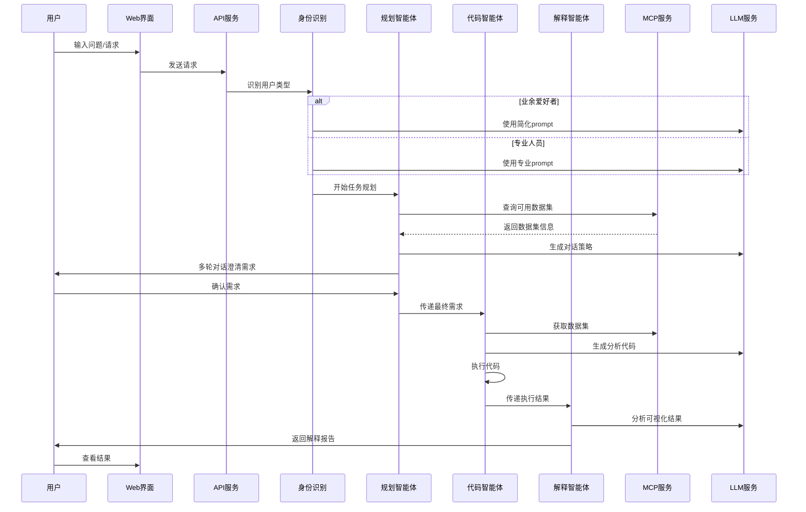
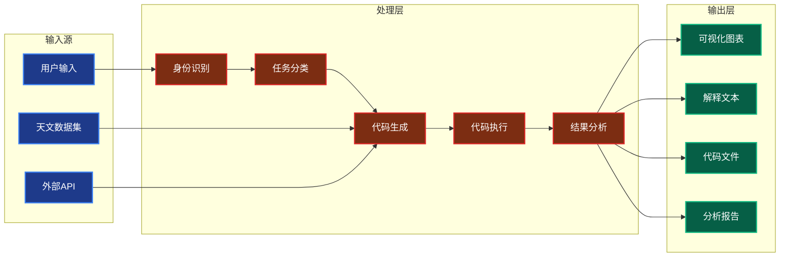
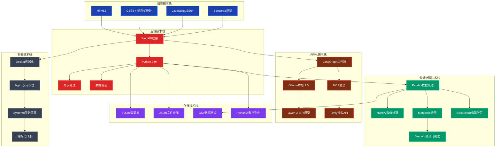

# Astro-Insight 项目架构流程图

## 🌌 核心系统架构

```mermaid
graph TB
    %% 用户交互层
    subgraph "用户交互层"
        UI[Web界面<br/>HTML/CSS/JS]
        API[REST API<br/>FastAPI]
    end
    
    %% 智能体层
    subgraph "核心智能体层"
        direction TB
        
        subgraph "主要智能体"
            IDENTITY[身份识别智能体<br/>Identity Check Agent]
            PLANNER[规划智能体<br/>Planner Agent]
            CODER[代码生成智能体<br/>Code Generator Agent]
            EXPLAINER[解释智能体<br/>Explainer Agent]
            QA[问答智能体<br/>QA Agent]
        end
        
        subgraph "支持智能体"
            TASK_SELECTOR[任务选择器<br/>Task Selector]
            ERROR_RECOVERY[错误恢复<br/>Error Recovery]
            REVIEW_LOOP[审查循环<br/>Review Loop]
        end
    end
    
    %% MCP服务层
    subgraph "MCP服务层"
        direction TB
        
        subgraph "数据服务"
            MCP_ML[机器学习MCP<br/>Model Training & Analysis]
            MCP_RETRIEVAL[数据检索MCP<br/>TAP Query Service]
        end
        
        subgraph "外部API"
            TAVILY[Tavily搜索API<br/>文献检索]
            SIMBAD[Simbad TAP<br/>天体数据查询]
        end
    end
    
    %% 数据处理层
    subgraph "数据处理层"
        direction TB
        
        subgraph "数据集管理"
            DATASET_MGR[数据集管理器<br/>Dataset Manager]
            DATASET_SELECTOR[数据集选择器<br/>Dataset Selector]
            DATA_PREPROC[数据预处理<br/>Data Preprocessing]
        end
        
        subgraph "存储系统"
            LOCAL_DB[本地数据库<br/>SQLite]
            QUERY_HISTORY[查询历史<br/>Query History]
            DIALOGUE_STORAGE[对话存储<br/>Dialogue Storage]
        end
    end
    
    %% LLM层
    subgraph "LLM服务层"
        direction TB
        
        subgraph "LLM类型"
            BASIC_LLM[基础LLM<br/>Basic LLM]
            CODE_LLM[代码LLM<br/>Code LLM]
            VISION_LLM[视觉LLM<br/>Vision LLM]
            REASONING_LLM[推理LLM<br/>Reasoning LLM]
        end
        
        subgraph "LLM提供商"
            OLLAMA[Ollama<br/>本地部署]
            QWEN[Qwen 2.5:7b<br/>中文优化]
        end
    end
    
    %% 工作流层
    subgraph "工作流层"
        direction TB
        
        subgraph "对话管理"
            DIALOGUE_MGR[对话管理器<br/>Dialogue Manager]
            STATE_MGR[状态管理器<br/>State Manager]
            TASK_DECOMPOSER[任务分解器<br/>Task Decomposer]
        end
        
        subgraph "代码执行"
            CODE_EXECUTOR[代码执行器<br/>Code Executor]
            SYNTAX_VALIDATOR[语法验证器<br/>Syntax Validator]
            ERROR_HANDLER[错误处理器<br/>Error Handler]
        end
    end
    
    %% 连接关系
    UI --> API
    API --> IDENTITY
    
    IDENTITY --> PLANNER
    PLANNER --> CODER
    CODER --> EXPLAINER
    EXPLAINER --> QA
    
    TASK_SELECTOR --> PLANNER
    ERROR_RECOVERY --> CODER
    REVIEW_LOOP --> EXPLAINER
    
    PLANNER --> MCP_ML
    PLANNER --> MCP_RETRIEVAL
    MCP_RETRIEVAL --> SIMBAD
    QA --> TAVILY
    
    CODER --> DATASET_MGR
    DATASET_MGR --> DATASET_SELECTOR
    DATASET_SELECTOR --> DATA_PREPROC
    
    DIALOGUE_MGR --> LOCAL_DB
    DIALOGUE_MGR --> QUERY_HISTORY
    DIALOGUE_MGR --> DIALOGUE_STORAGE
    
    IDENTITY --> BASIC_LLM
    PLANNER --> BASIC_LLM
    CODER --> CODE_LLM
    EXPLAINER --> VISION_LLM
    QA --> BASIC_LLM
    
    BASIC_LLM --> OLLAMA
    CODE_LLM --> OLLAMA
    VISION_LLM --> OLLAMA
    REASONING_LLM --> OLLAMA
    
    OLLAMA --> QWEN
    
    PLANNER --> DIALOGUE_MGR
    CODER --> STATE_MGR
    EXPLAINER --> TASK_DECOMPOSER
    
    CODER --> CODE_EXECUTOR
    CODE_EXECUTOR --> SYNTAX_VALIDATOR
    SYNTAX_VALIDATOR --> ERROR_HANDLER
    
    %% 样式定义
    classDef userLayer fill:#2d3748,stroke:#4a5568,stroke-width:2px,color:#ffffff
    classDef agentLayer fill:#1a365d,stroke:#2c5282,stroke-width:2px,color:#ffffff
    classDef mcpLayer fill:#553c9a,stroke:#7c3aed,stroke-width:2px,color:#ffffff
    classDef dataLayer fill:#065f46,stroke:#047857,stroke-width:2px,color:#ffffff
    classDef llmLayer fill:#7c2d12,stroke:#dc2626,stroke-width:2px,color:#ffffff
    classDef workflowLayer fill:#374151,stroke:#6b7280,stroke-width:2px,color:#ffffff
    
    class UI,API userLayer
    class IDENTITY,PLANNER,CODER,EXPLAINER,QA,TASK_SELECTOR,ERROR_RECOVERY,REVIEW_LOOP agentLayer
    class MCP_ML,MCP_RETRIEVAL,TAVILY,SIMBAD mcpLayer
    class DATASET_MGR,DATASET_SELECTOR,DATA_PREPROC,LOCAL_DB,QUERY_HISTORY,DIALOGUE_STORAGE dataLayer
    class BASIC_LLM,CODE_LLM,VISION_LLM,REASONING_LLM,OLLAMA,QWEN llmLayer
    class DIALOGUE_MGR,STATE_MGR,TASK_DECOMPOSER,CODE_EXECUTOR,SYNTAX_VALIDATOR,ERROR_HANDLER workflowLayer
```

## 🔄 用户对话流程

## 📊 数据流向图

## 🛠️ 技术栈架构

## 🔧 核心组件说明

### 智能体层
- **身份识别智能体**: 判断用户是业余爱好者还是专业人员
- **规划智能体**: 管理多轮对话，分解复杂任务
- **代码生成智能体**: 生成天文数据分析代码
- **解释智能体**: 解释可视化结果和代码逻辑
- **问答智能体**: 处理一般性天文问题

### MCP服务层
- **机器学习MCP**: 提供模型训练和数据分析服务
- **数据检索MCP**: 连接Simbad TAP服务进行天体数据查询
- **外部API集成**: Tavily搜索、Simbad数据库等

### 数据处理层
- **数据集管理**: 管理SDSS星系数据、恒星分类数据等
- **存储系统**: SQLite数据库、查询历史、对话记录

### LLM服务层
- **多种LLM类型**: 基础、代码、视觉、推理专用模型
- **本地部署**: 使用Ollama部署Qwen 2.5:7b模型

### 工作流层
- **对话管理**: 多轮对话状态跟踪
- **代码执行**: 安全的代码执行环境
- **错误处理**: 智能错误恢复机制

---

*该架构图展示了Astro-Insight项目的完整技术栈和组件关系，采用模块化设计，支持扩展和维护。*

